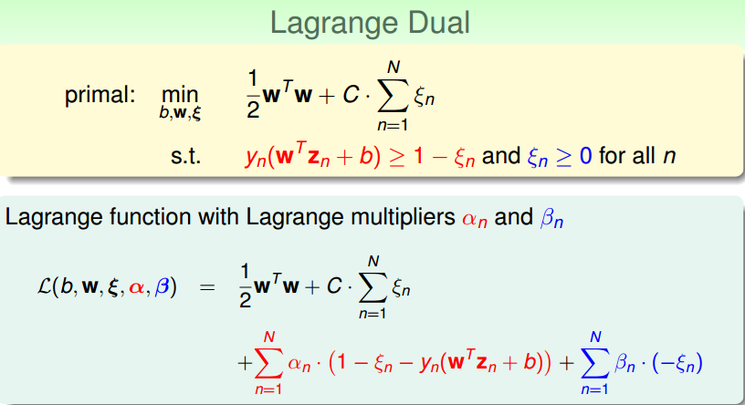
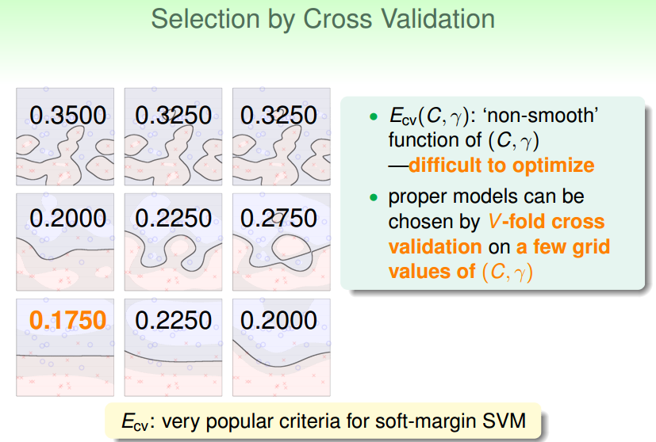

# 软间隔支持向量机

支持向量机的内容可真够多啊！

## 1. 动机

从之前学习的核支持向量机中，给我们的一个概念就是，就算是SVM也有可能会产生过拟合。这里总结一下SVM产生过拟合的大致原因：

* 我们的kernel太powerful了，比如选择了一个高斯核，然后参数γ选择得比较大，那就很容易过拟合
* 我们坚持资料完美地分开，也就是不管什么data都能够被shatter，就算是data里面有噪声也会被shatter，自然就有可能会过拟合。

如上图中的两种分法，虽然φ(1)的分割线会产生一点点错误，φ(4)对数据完美地进行了划分，但是我们可能任然会觉得，左边的model更为合理。相当于我们放弃了一些我们认为的噪声的data。

## 2. 软间隔原始问题

所以现在参考一下以前的做法，比如pocket。当pocket算法实在无法将数据完美地分开的时候，算法会选择一个使分类错误的点数最小的模型参数。也就是说放弃一些数据点，实在分不过来就算了。那我们的SVM也可以借鉴类似的算法。如下图：

我们原始的SVM算法是要求所有的数据分类正确，并且在所有能分类正确的分割线中选择一条w最短的(也就是间隔最大)。条件的限制很严格，所以我们SVM可以做的事情是在条件上放松一点，也就是说像pocket一样容忍一些错误。所以我们可以将SVM和pocket结合起来(如上图)，首先在target function中我们还是有一项是希望w最短，对于能够做对的点也是要符合老的large-margin的条件。做错的点就不管了(>-∞)。当然仅仅这样是不行的，我们还需要告诉target function，做错的点要越少越好。

C适用于权衡w的长度和分类错误点的个数的重要性：
* 当C比较大的时候表示分类的正确的点越多越好，即使w的长度大一点（margin小一点）也无所谓
* 当C比较小的时候表示w的长度越短越好，即使会产生一些误分类的点也没问题

### 2.1 软间隔SVM的初级表达式

通过上面的描述，我们将软间隔SVM初步表达如下：

这样表述有一些缺点：
* 不管条件和目标函数中都有一个[[]]符号，这是一个非线性的运算，那我们的问题就不再是QP问题了，所以我们需要转换一下。
* 对错误的个数进行拟合的话不能够区分大错误和小错误，一个分数(yn(wzn + b))为-1的点和一个分数为-1000的点将被看成同样的错误。但是这两个分类错误的点显然不能同等看待。分数为-1的点是一个小错误，-1000是一个大错误。

所以我们提出一个新的式子，它可以区分小错误和大错误，而且能够维持QP的特性

我们引入了一个松弛变量ξ>=0，这个松弛变量用来干什么呢？对于原始的SVM条件，我们要求每一个点的函数间隔大于等于1，现在我们放宽条件，对于函数间隔不大于等于1的点，我们可以放宽要求让函数间隔加上这个ξ才大于等于1，但是对于使用了ξ的点来说，需要付出一个ξ的代价，也就是在target function中加上一个ξ。如下图所示：

所以我们新的式子满足之前提的要求：

* ξ相当于一个记录了每个点违反边界的数量，是一个线性的量，
* 对于违反边界较多的点，相对应的ξn就比较大，对于违反边界较少的点，相对应的ξn就比较小

所以新的式子满足QP的要求，且能很好地反映大错和小错。 

其实如果此时的Z空间如果比较简单的话，就可以直接使用QP solver来解w和b了。不用再求对偶然后转换为另一个QP问题。

## 3. 软间隔对偶问题

老规矩，如果你想要移除对特征转换所带来的高维特征的依赖，那么就要求解拉格朗日对偶问题。

### 3.1 拉格朗日原始问题

和hard-margin SVM一致，首先需要写出带有拉格朗日乘子的拉格朗日函数：

### 3.2 拉格朗日对偶问题

和hard-margin SVM一致，这里就不在证明了，根据拉格朗日的对偶性，我们可以写出拉格朗日原始问题(min(max()))的拉格朗日对偶问题(max(min()))：

### 3.3 KKT Condition简化问题

依然同hard-margin一致，当我们列出来拉格朗日对偶问题的时候，可以利用KKT Condition来移除对w,b,ξ的依赖，从而化简问题。换件的过程如下，都是一些简单的微分，代换操作。

#### 3.3.1 对ξn微分

* 对ξn求微分，得出an和βn的关系式，所以可以在目标函数中把βn用an表示出来。
* 同时因为βn的消失，an的取值范围也要做相应的改变。
* 此时利用an和βn和C之间的关系式，可以将ξ移除掉。

#### 3.3.2 对其他的变量微分

接下来就是对w,b微分：

从上图中可以很轻易地看出，本对偶问题的内部和hard-margin的对偶问题的内部是一致的。max部分an的取值范围不一样。所以我们可以采取同hard-margin相同的方法来移除掉w,b。推到过程不在赘述。

#### 3.3.3 标准的soft-margin SVM对偶问题

经过上面的推导，我们可以得到一个同原来的hard-margin SVM几乎一样的形式的问题，唯一的差别是an的取值范围要小于等于C

所以现在就得到了一个新的关于a的QP问题，该问题有N个变量，2N+1个条件

## 4. Message behind Soft-margin SVM

在得出了对偶形式后，接下来的工作同hard-margin SVM一致，大概就是通过QP solver来求解an，然后利用KKT条件来求解b,w，当然，因为是对偶问题，所以上述操作都可以使用kernel trick。

所以暂时可以得出如下结论：
* soft-margin和hard-margin几乎是一样的
* 因为有C参数可以调节，所以比hard-margin更灵活
* 因为松弛变量的原因使得我们的问题总是有解的

w可以很容易根据KKT条件求出来，但是b呢？因为我们加入了ξ变量，所以KKT条件改变了，但是依然可以用类似的方法来求解b。

首先来回忆一下hard-margin是怎么做的。hard-margin会找出一个an大于0的点(support vector)，然后利用KKT condition的关系代入该点的相关值求出b。

同样的，对于我们的soft-margin：
* 首先我们可以将相关的条件列出来
* 然后找出一个an大于0的点(support vector)，利用条件一将b表示出来
* 但是b的表达式中ξn是未知的
* 根据第二个条件可知，当an不等于C时，ξn就必须等于0，所以此时就可以求出b
* 所以我们需要找一个点，该点的0 < an < C，这样ξn就等于0，就可以求出b的表达式了

我们管0 < an < C这样的support vector叫做free support vector。那会不会出现没有free support vector的情形呢？会的，但是很少出现，这样的会b只能由一个范围表示，但前提是必须满足kkt condition。

### 4.1 soft-margin SVM的表现

下面用一个高斯核的SVM通过调节参数C来比较不同C产生的效果。

C=1：
* 我们的SVM犯了一些错误（我们说的错误不仅仅是分类错误，还有违反边界的错误，比如data位于margin内也是一种错误），但是看起来似乎还不错

C=10：
* 很在乎尽量不要犯错，边界瘦一点没关系，所以看起来犯的错误比C=1时要少一些

C=100：
* 几乎不能容忍犯错，如图中，会产生非常复杂的边界。很容易overfitting

哈哈，就算是soft-margin SVM,也是可能产生过拟合的。所以对于soft-margin SVM，选择参数也是需要慎重的。

### 4.2 an的物理意义

如上图中所示，我们可以将data分成3种点：

1. 第一类点是0 < an < C（free support vector）的点，ξn=0，也就是yn(wzn+b) = 1的点，该类点位于我们的边界上，用于计算b的值。
2. 另一类是an = 0的点(non-support vector)，ξn = 0，也就是没有违反任何边界的点。当然这样的点大部分位于边界外面，也有极少部分位于边界上。
3. 第三类是an = C的点(bounded support vector)，ξn = 违反的大小，表示违反边界的点(少部分没有违反)。当然大部分的点都是违反了边界的点，位于边界里面或分类错误，少部分的点位于边界上(违反的大小=0)。

根据第二点可以，我们的大多数点的an系数都为0，所以a具有稀疏性

## 5. 模型选择

学完了soft-margin SVM之后，我们发现我们面临的选择变多了，比如选择什么kernel？如果kernel里面有参数应该选择什么参数？如果使用soft-margin的SVM那么选择什么样的C？

如上图，我们以使用了高斯核的soft-margin SVM为例来讲解。每一张图对应了不同的(C,γ)的模型的学习结果。其中横轴的变化量是C，纵轴的变化量是γ，按照标准的坐标递增。那我们如何来衡量一个模型的好坏呢？那就用我们之前学过的validation咯。如下所示：

将每种模型的Ecv计算出来，哪个模型的Ecv小我就选哪一个，对于SVM来说这是一个非常常用的方式来选择模型。

当我们对SVM使用leave-one-out的validation的时候，会有一个关于Eloocv的结论：

这个结论就是SVM的leave-one-out的Error会小于等于支持向量的比例。所以从某种角度来说我们可以根据支持向量的个数来对模型进行选择。但是记住了，支持向量的比例只是一个Eloocv的上限，所以一般不用此方法来选择。通常用此方法来排除比较危险的模型（SV很多的模型）。
